# мини отчет 1
### Костя Борисов

## **1.** про `FASMW.EXE`
`FASMW.EXE` это очень плохой ide (например там неработает ничего кроме ascii и нет тёмной темы),
а `FASM.EXE` работает только когда `pwd = INCLUDE`,
поэтому я написал небольшой скрипт, чтобы можно было компилить как в `tcc`
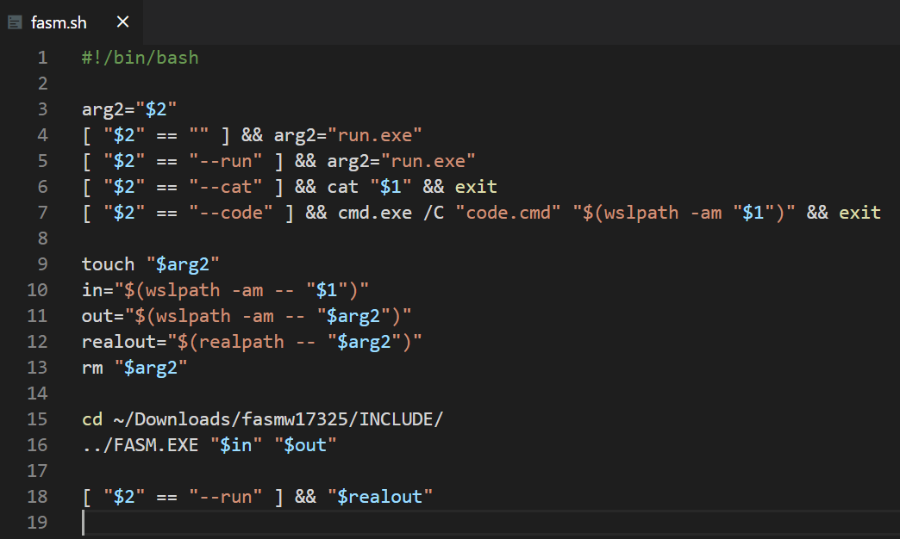
<!-- 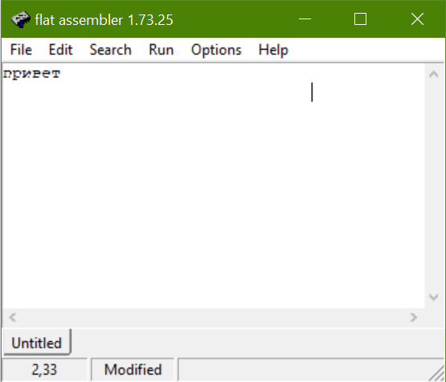 -->
это также решает проблему с `getch`-ами: мне ненадо их делать, тк я все програмы запускаю из терминала
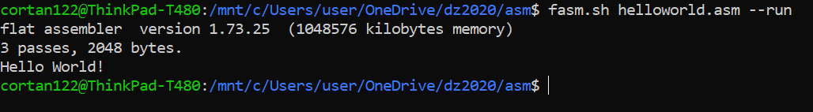

## **2.** про консольные программы
`fasm` повидимому не самый популярный ассемблер, и,
потомучто его основное преимущество над си --
это возможность нагло импортировать любой метод из любого `dll`,
на нём восновном пишут GUI-шные программы.
поэтому найти 5 консольных программ у меня неполучилось и мне пришлось 2 из них писать самому

## **3.** примеры
### **3.1.** [Hello World](https://board.flatassembler.net/topic.php?p=150882)
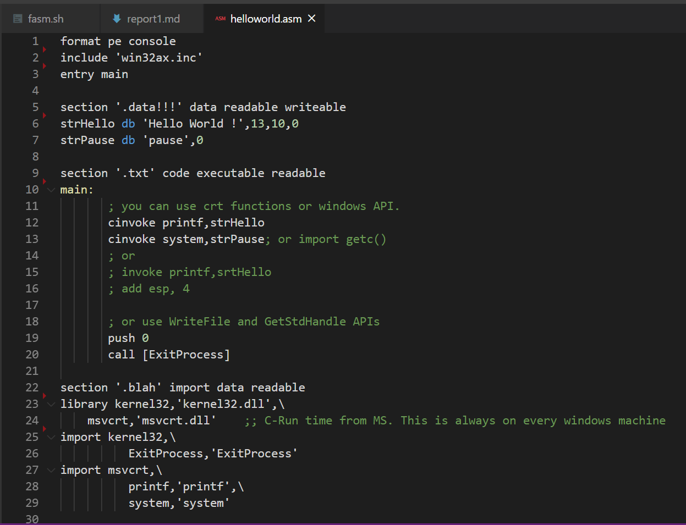
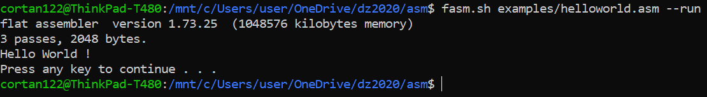
тут видно что названия секций и их порядок ни на что не влияют

### **3.2.** ["объектно ориентированное программирование"](https://board.flatassembler.net/topic.php?t=16525)
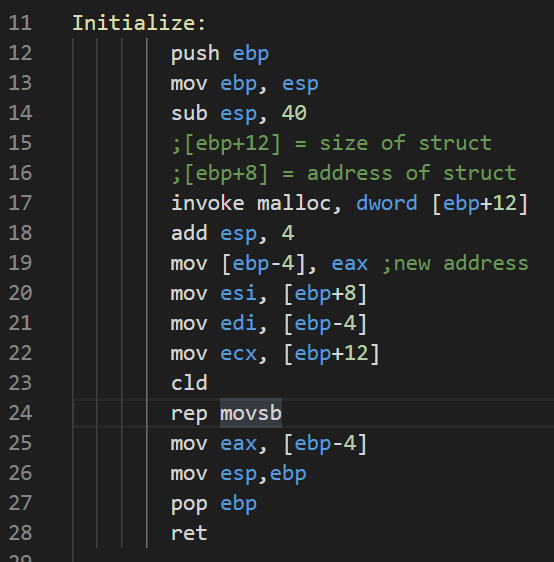
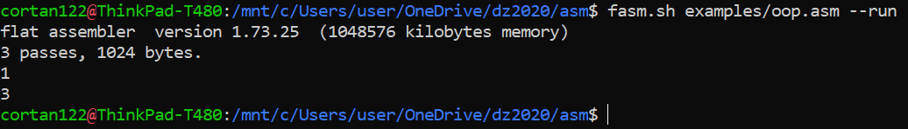
тут используются вызовы небиблиотечных функций

### **3.3.** [floating point arithmetic](https://board.flatassembler.net/topic.php?t=17905)
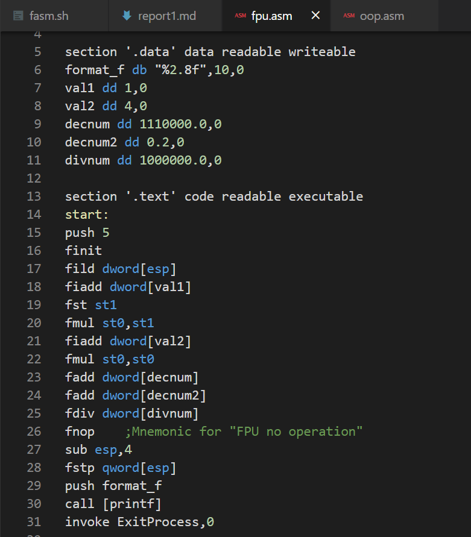
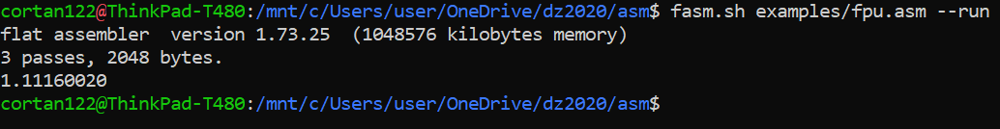
тут соовсем нет индентации (значит `fasm` на неё не смотрит)

### **3.4.** FizzBuzz
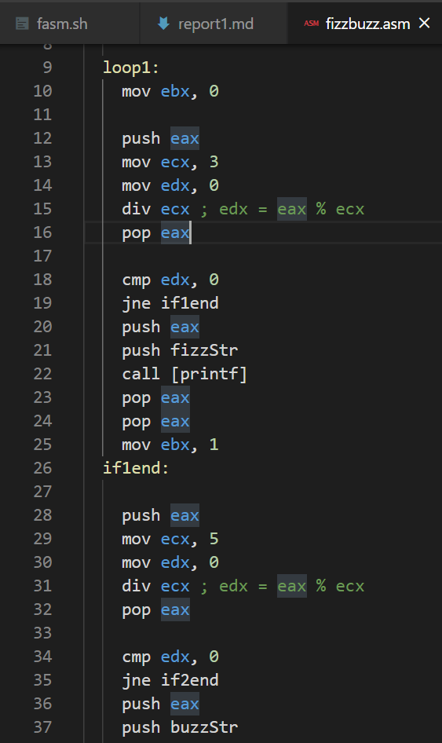
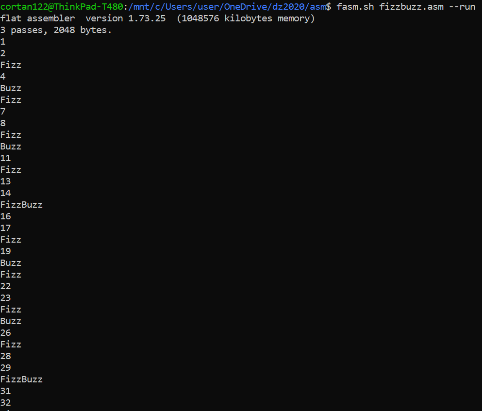
тут используется непонятная инструкция `div`

### **3.5.** scanf test
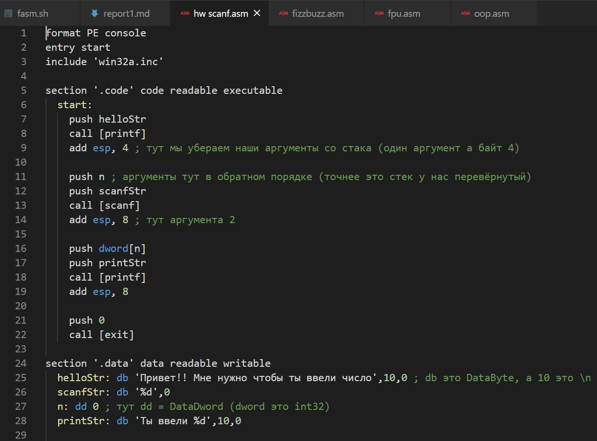
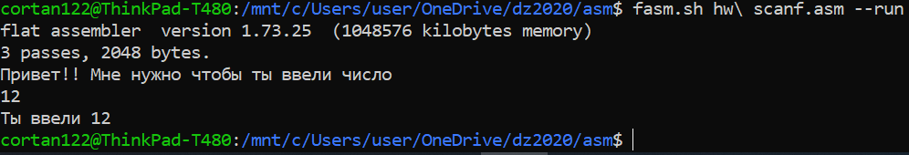
тут я в кометнах расписал вся что было непонятно

## **4.** Honorable Mentions
### **4.1.** [syntax](https://board.flatassembler.net/topic.php?t=16629)
в `fasm`-е настолько мощный язык препроцессора,
что его можно заставить генерировать не `exe` а HTML
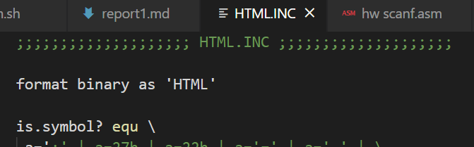
