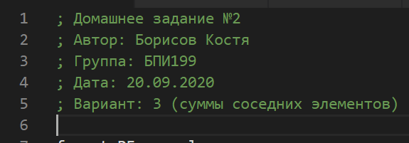
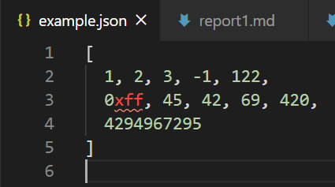
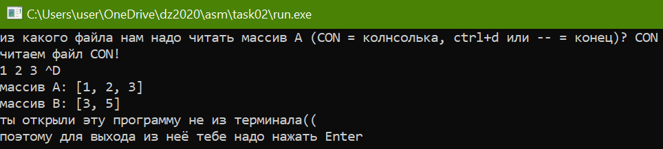
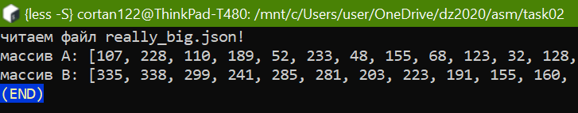
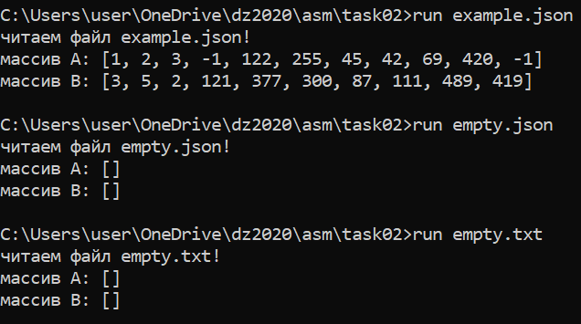
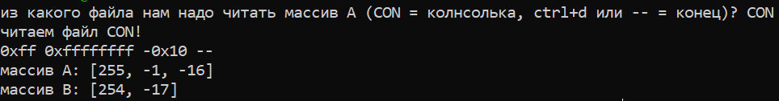
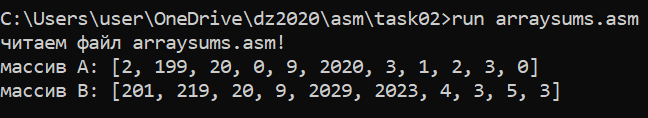

# мини отчет 2
### Костя Борисов

[код тут](https://github.com/Cortan122/fasm/blob/master/task02/arraysums.asm)

тут моя прога читает масив из json файла (например такого)

также, для удобства пользователя, можно вводить массив с консоли,
и ненадо зарание вводить его длинну

## допфичи
### 1. `realloc`
поскольку тут используется динамическое выделение памяти, программа может работать с файлами любого размера.
легче всего это проверить перенаправив вывод в `less -S`

### 2. `getch`
программа не просит пользователя нажать Enter, если он запустил её из терминала

### 3. `0x`
используя `%i` в `scanf`-е, программа умеет поминать числа, написанные на в десятичной системе счисления

### 4. `json`
порграмма читает `json` игнорируя все ненужные символы.
поэтому она может читать вообще любой файл, в котором есть числа.
например даже свой исходный код

